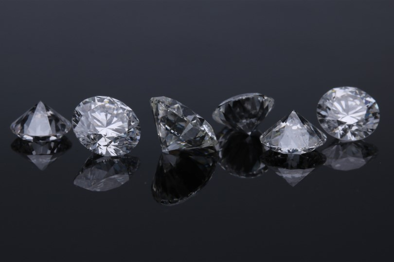

# Gemstone Price Prediction

## Description

Gemstones are highly valuable and prized for their beauty, rarity, and unique characteristics. Predicting their prices accurately can help gemstone traders, collectors, and enthusiasts make informed decisions about buying and selling gemstones.

The gemstone market is dynamic and influenced by various factors such as supply and demand, gemstone quality, market trends, and economic conditions. Developing a predictive model for gemstone prices can provide insights into market dynamics and help individuals and businesses navigate this industry.

Gemstones are often considered alternative investments and can hold significant value over time. Accurate price predictions can assist investors in assessing the potential returns and risks associated with gemstone investments.

Overall, the problem of gemstone price prediction combines elements of finance, data analysis, market dynamics, and consumer awareness, making it a fascinating and relevant area of study for gemstone enthusiasts, traders, and researchers.

## Problem Statement

Predict the gemstone price using Machine Learning techniques.

## Files

- `Datasets/train.csv` - the training dataset; price is the target.
- `Datasets/test.csv` - the test dataset; your objective is to predict price.
